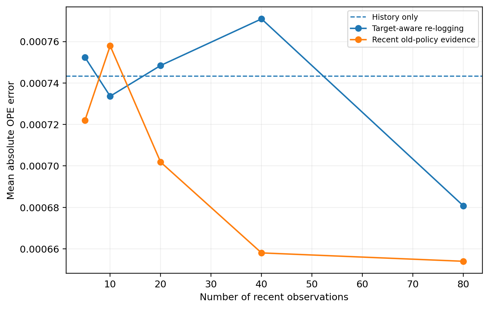
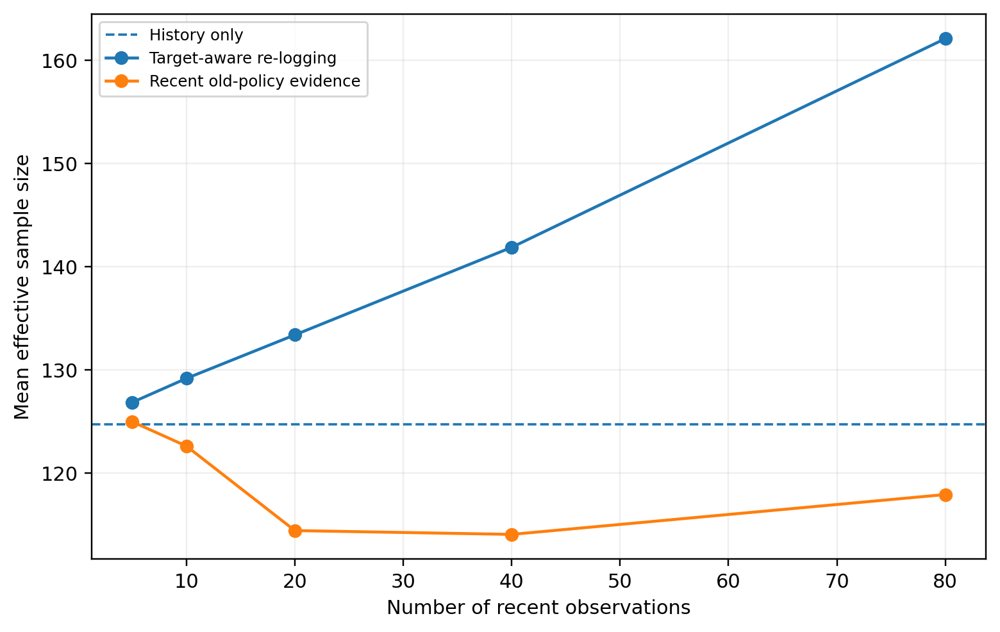
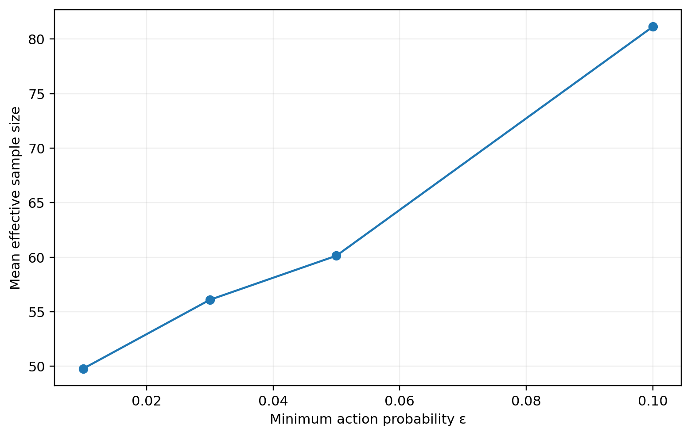
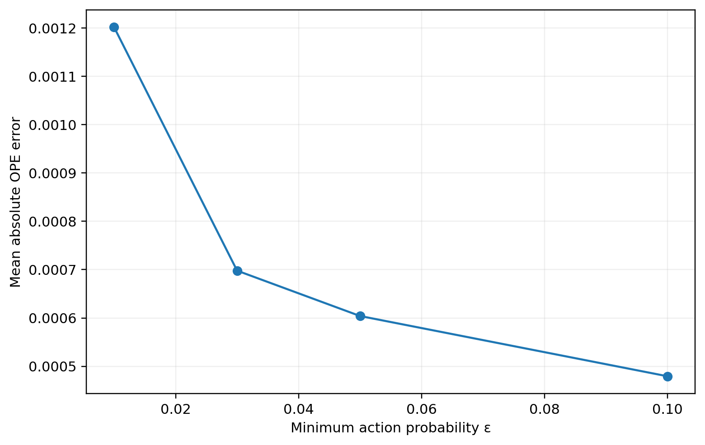

# Historical Evidence for Off-Policy Evaluation under Nonstationarity

This repository contains the code, archived result summaries, and public-facing article for a study of a practical off-policy evaluation (OPE) problem:

**When the environment changes, how much can we still trust evidence collected by an older policy?**

The experiment uses daily QQQ data as a long, auditable sequential data source. QQQ is not the research target and this repository is not a trading system. The methodological setting is a one-step contextual bandit. A stochastic Thompson-sampling behavior policy chooses among three exposure adjustments, only the selected action reward is shown to the learner, and the unchosen one-step rewards are kept hidden until evaluation. That hidden reward vector gives the study a way to measure OPE error directly.

The project is organized around three properties of logged evidence:

- **Relevance** — whether older observations still describe the environment of interest.
- **Coverage** — whether the behavior log contains enough support for actions favored by a target policy.
- **Precision** — whether an estimated policy-value difference is large enough relative to uncertainty to justify a decision.

## Research questions

The current release reproduces five experiments.

1. How well do DM, IPS, SNIPS, and doubly robust (DR) estimation recover a hidden one-step oracle?
2. Under nonstationarity, should evaluation use all history, a recent window, exponential decay, or decay with a simple regime-similarity weight?
3. Do recent old-policy observations and target-aware re-logging improve the same kind of evidence?
4. What happens when a candidate policy is accepted only after accounting for uncertainty and effective sample size (ESS)?
5. Does broader logging exploration improve the future evaluability of target policies?

The code also repeats the main experiments under multiple simulated behavior-policy seeds and includes a controlled synthetic stress test for the lower-confidence-bound update rule.

## Main findings

The repository is meant to preserve the empirical record, not to turn one experiment into universal rules. The main results are:

- Standard OPE estimators produced reasonably small value errors, but selecting the best policy was much harder when candidate values were close.
- Very short historical windows were less reliable than longer histories on average. Selective forgetting occasionally helped, so the result does not imply that all old data should always be retained.
- Recent old-policy observations and simulated target-aware re-logging affected OPE differently. The former improved current relevance more directly; the latter increased target-policy coverage and ESS.
- ESS was useful as an overlap diagnostic, but it did not summarize staleness, model error, or policy-value uncertainty.
- A confidence-based update rule largely abstained when estimation uncertainty was much larger than the candidate-baseline value gap.
- Across the tested exploration range, broader logging support increased ESS and reduced OPE error.

These findings motivate an **evidence-management** view of OPE under change: relevance, coverage, and precision should be checked separately rather than compressed into a single diagnostic.

## Repository layout

```text
historical-evidence-ope/
├── README.md
├── REPRODUCIBILITY.md
├── CITATION.cff
├── requirements.txt
├── src/
│   └── historical_evidence_ope.py
├── data/
│   └── README.md
├── results/
│   ├── README.md
│   ├── figures/
│   └── tables/
└── paper/
    ├── README.md
    └── public_facing_article.pdf
```

The raw market data are intentionally **not** stored in this repository. The script downloads the required QQQ history locally and writes generated data and metadata under the repository directory.

## Quick start

Use a recent Python 3 environment. The original archived run used Python 3.13.5 and `yfinance` 0.2.65.

Install the required packages:

```bash
pip install -r requirements.txt
```

Run the complete experiment:

```bash
python src/historical_evidence_ope.py
```

The same file can also be opened in Spyder and run with **Run File**.

The public-release script writes output under the repository root. It pins the data cutoff at `2026-08-14` (exclusive in the download call), matching the original experiment through `2026-08-13`.

A fast synthetic logic check is also included in the script. To use it, comment out `main()` at the bottom of the file and uncomment `synthetic_smoke_test()`.

See [REPRODUCIBILITY.md](REPRODUCIBILITY.md) for the full procedure and the expected outputs.

## Data

The experiment reconstructs QQQ market history with `yfinance`. Raw third-party market data are not redistributed here.

The original study used:

- symbol: `QQQ`
- requested start date: `2000-01-01`
- final processed period: `2000-02-01` through `2026-08-13`
- processed decision points in the archived run: `6,673`

The script stores download metadata, data-quality checks, package versions, configuration values, and processed files locally when it runs.

See [data/README.md](data/README.md) for details.

## Results

The `results/` directory contains compact tables and figures from the archived v3.1 experiment. Detailed intermediate files are deliberately left out of the first public release because they can be regenerated from the script.

Two results capture the central distinction in the paper:

### Recency and coverage behave differently





Adding recent observations generated by the old policy reduced OPE error without increasing ESS, while target-aware re-logging increased ESS much more directly. That is the empirical reason the paper treats recency and coverage as separate properties of evidence.

### Exploration changes future evaluability





Within the tested range, greater minimum action probability produced broader support, higher ESS, and lower OPE error. This is a local empirical result, not a claim that more exploration is always better.

See [results/README.md](results/README.md) for the mapping between files and experiments.

## Scope and limitations

This is a **one-step contextual-bandit laboratory**, not a full counterfactual portfolio simulator.

A different action changes the next position, so the hidden oracle evaluates immediate action rewards at the logged pre-action position; it does not reconstruct an alternative multi-step trajectory. The behavior logs are simulated, the action space is intentionally small, and the current DR implementation uses Ridge reward models without time-block cross-fitting.

Validation uses the hidden oracle to compare evidence rules. That is useful for studying the behavior of the methods, but it is not a deployable tuning procedure because a real system would not observe those counterfactual rewards.

Several robustness checks reuse the same underlying QQQ history while changing the simulated behavior log. They therefore measure sensitivity to logging randomness rather than independence across environments.

The next research step is to replace oracle-assisted evidence selection with observable drift, overlap, and uncertainty signals and to repeat the framework in a second, non-financial logged-decision environment.

## Paper and public article

A public-facing explanation is included here:

- [Public-facing article](paper/public_facing_article.pdf)

The formal working paper will be added after its author metadata and preprint record are finalized. Once an arXiv or SSRN identifier is available, this README and `CITATION.cff` should be updated to point to the canonical paper.

## Citation

GitHub can read the root-level [`CITATION.cff`](CITATION.cff) file. For the initial software release, the repository is cited under **Sequential Decision Research**. After the working paper receives its final author metadata and preprint identifier, the paper should become the preferred citation.

## License

Source code in this repository is released under the [MIT License](LICENSE).

The paper and public article remain subject to their own publication terms. Third-party market data are not redistributed and remain subject to the original provider's terms.

## Research use

This repository is for research and educational use. It does not place trades, connect to a brokerage account, or provide investment advice.

## Sequential Decision Research

This is the first public research repository under **Sequential Decision Research**, an independent research program focused on reinforcement learning, contextual bandits, off-policy evaluation, Bayesian sequential decision making, and adaptive decision systems.


